
<h1 align="center">基于SSM框架的在线学习系统设计与实现+vue</h1>

## 简介
在线学习系统：角色分为管理员、教师、学生；功能包括作业管理、论坛互动、教案展示、公告信息管理、个人中心操作、综合搜索与筛选功能。    --计算机毕业设计源码；毕设源码；java毕业设计源码

## 联系方式

<h3 align="center">获取完整代码与数据库文件 + 微信：deepguan QQ: 86050149 QQ群: 783742310</h3>

<h3 align="center">可帮忙远程部署 包运行成功！提供远程部署、修改代码、设计文档指导、代码讲解等服务！</h3>

## 功能介绍（完整见运行截图）
管理员： 登录界面提供登录和注册功能，用户可选择角色（管理员、教师、学生）登录系统。系统提供了一系列管理模块，包括用户管理、课程管理、论坛管理、公告信息管理、作业管理等。管理员可以在管理界面中查看、添加、修改和删除平台内容，如公告、作业、通知和论坛帖子等，并可访问相关统计数据和管理后台内容。管理员可以通过导航栏访问各个功能模块，并进行日常管理的必要操作。

教师： 教师在登录系统后，可以访问个人中心和管理界面，进行作业发布与管理，创建与查看教案，并查看学生提交的作业。教师还可以参与论坛讨论，回复学生提问，并在系统中添加公告信息。同时，教师可以通过平台上传多媒体教学资源，查看教案点击次数及下载次数，并对教学资源进行详细管理。

学生： 学生可以通过系统进行作业提交与查询，查看所参加课程的详细信息，并在个人中心管理个人信息。此外，学生可以浏览并参与论坛，与教师和其他学生进行讨论交流。学生还可以通过筛选搜索和点击导航栏获取公告通知、查看教学资料和教学资源，以及查看教案和相关学习资料。学生用户可通过简单的表单导航系统内容。

来访者： 来访者可以访问系统首页，查看平台功能概览。在登录或注册后，来访者可以根据选择的角色访问相应的功能模块和内容。平台提供了简洁友好的首页，包含导航栏、图片轮播等功能，便于来访者快速了解平台。同时，为来访者准备了论坛板块，用于交流和获取更多平台相关信息。

## 运行截图
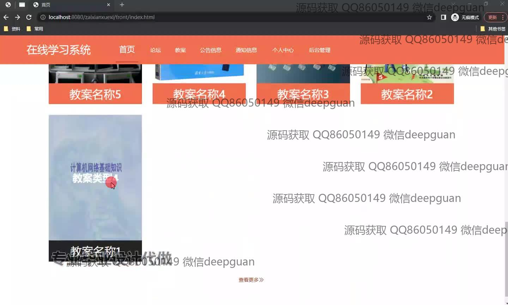
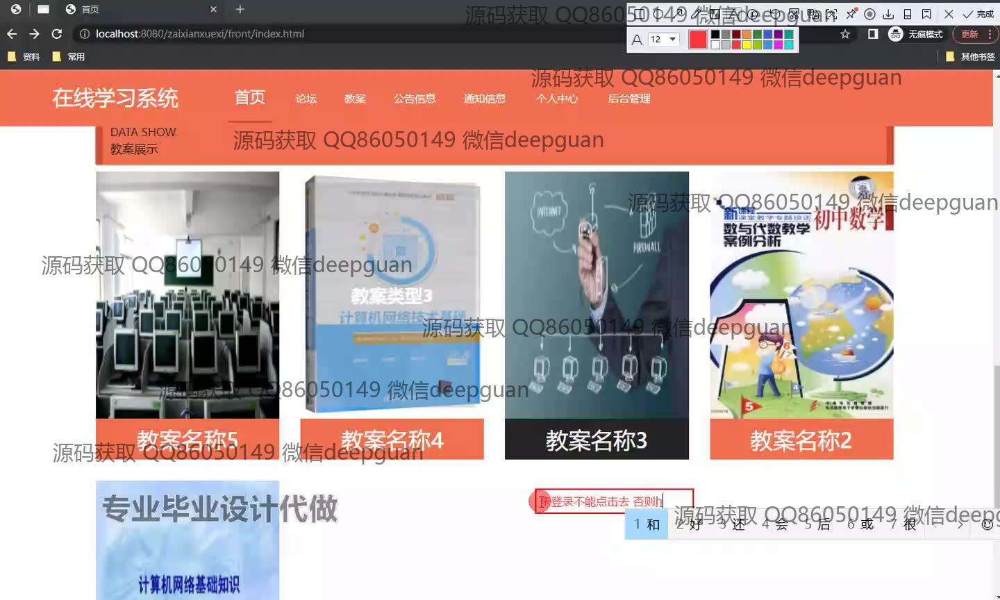
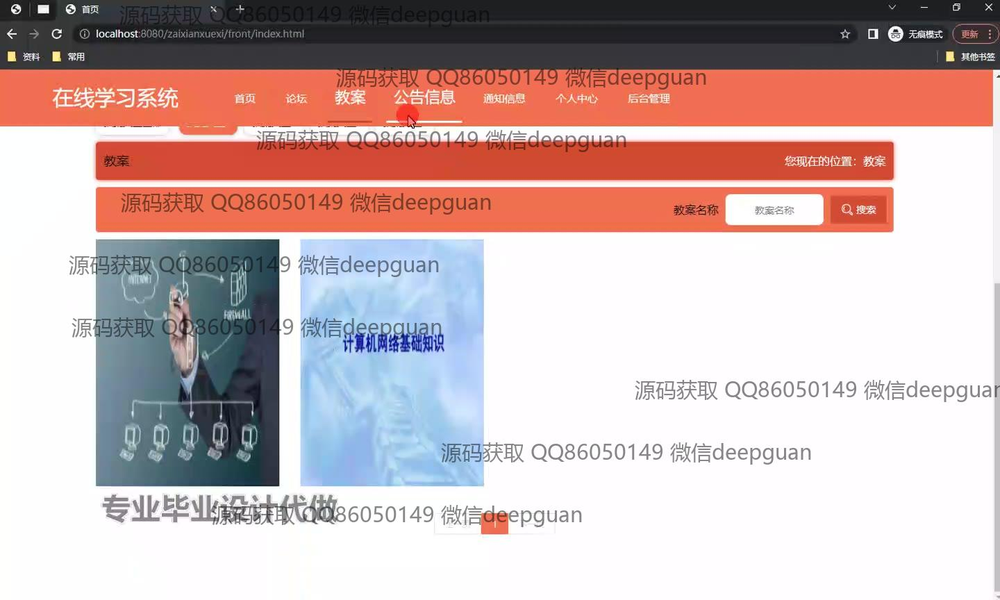
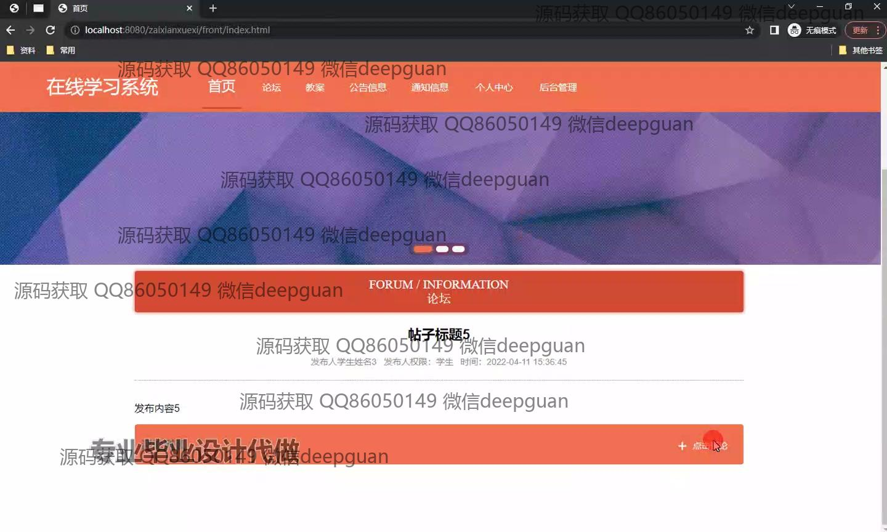
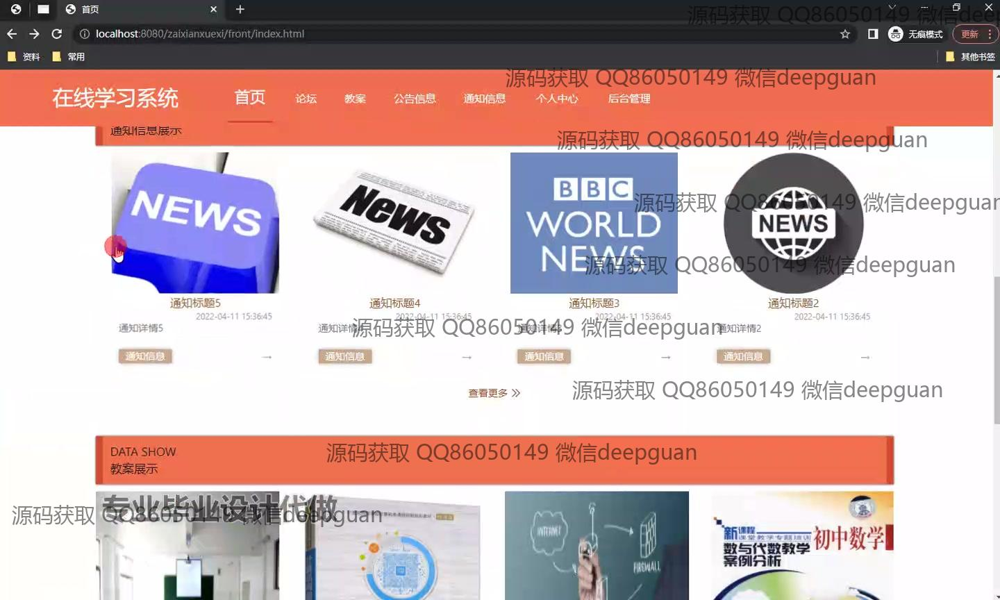
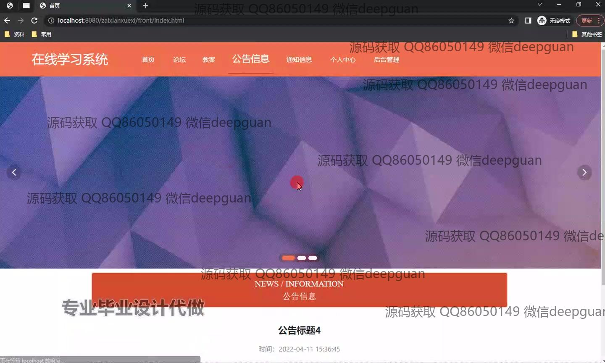
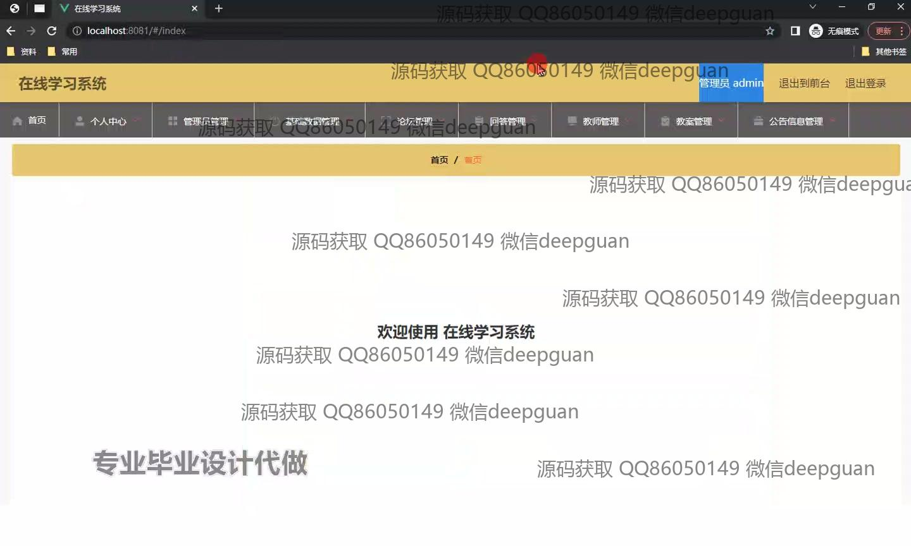
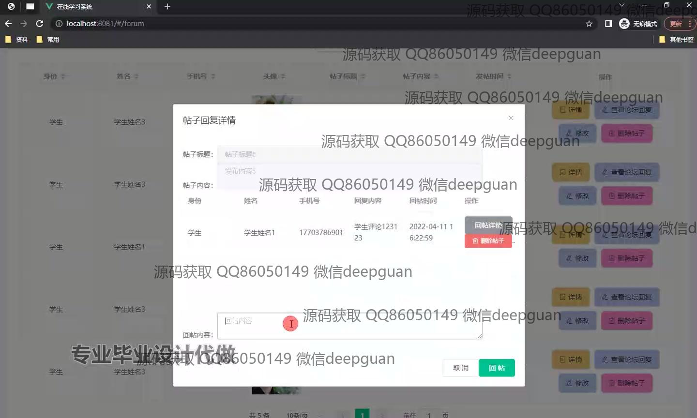
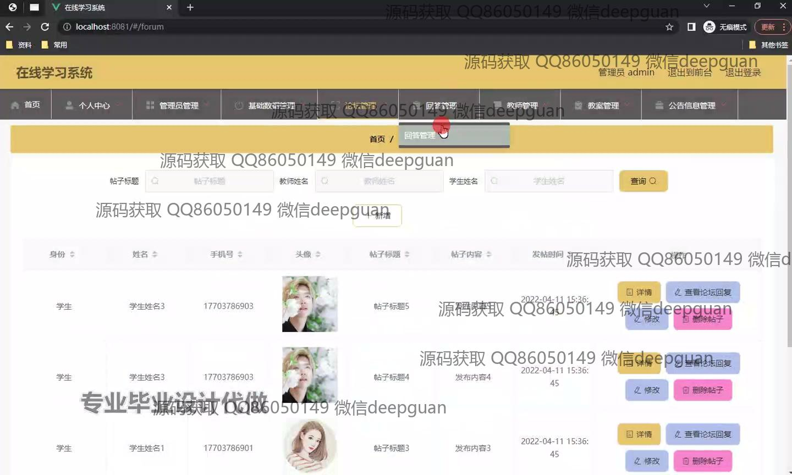
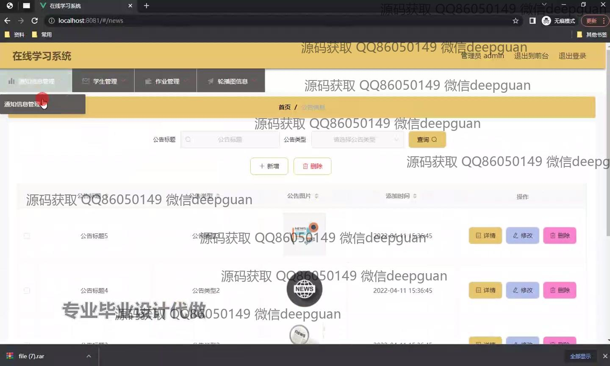
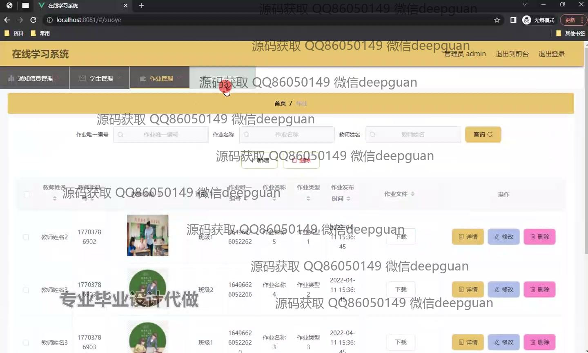
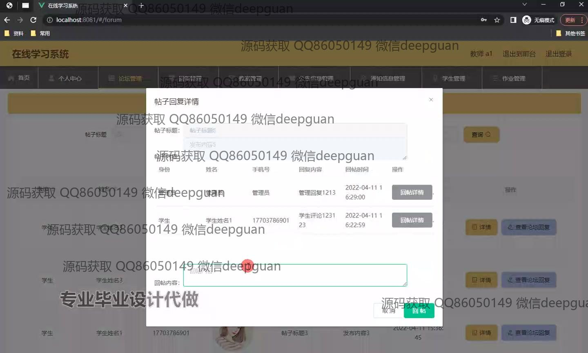
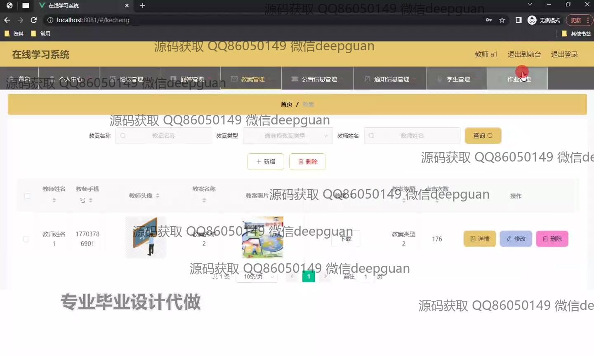
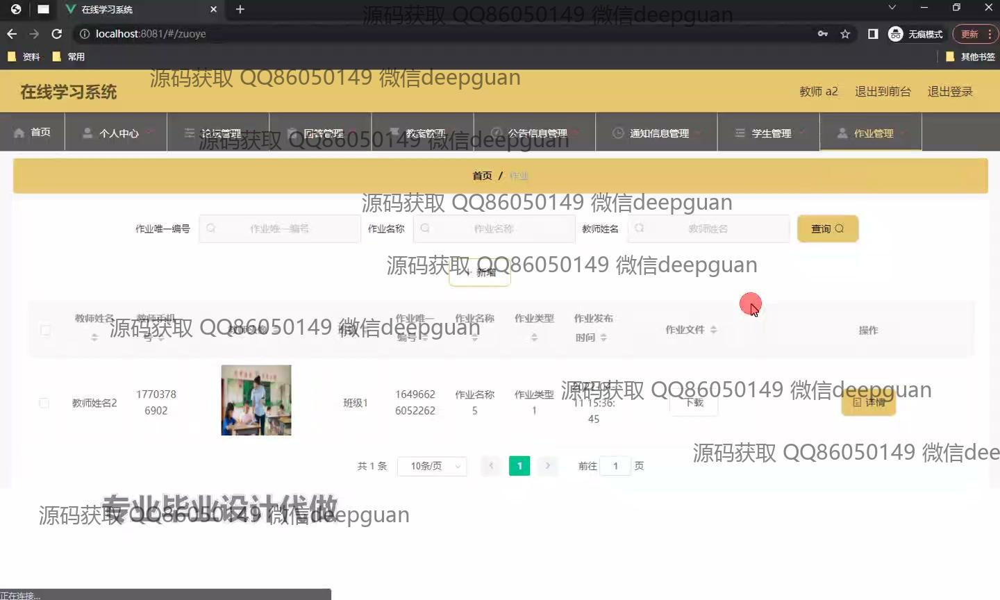
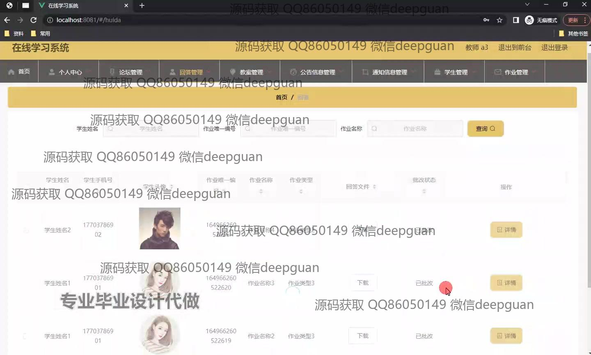
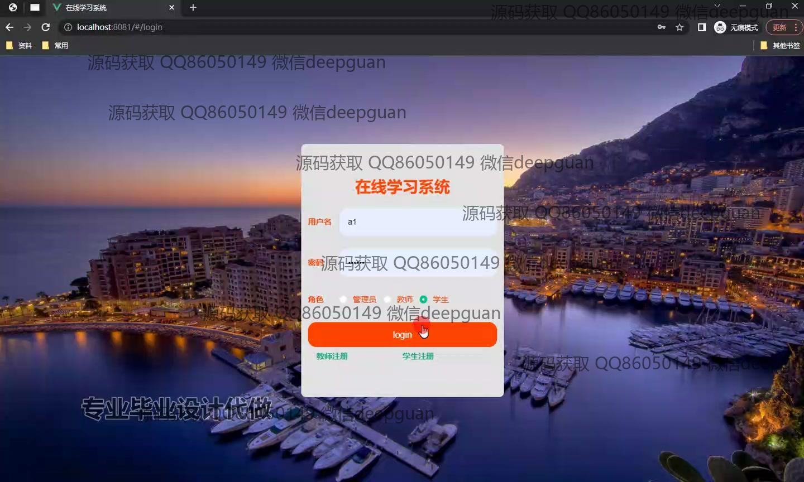
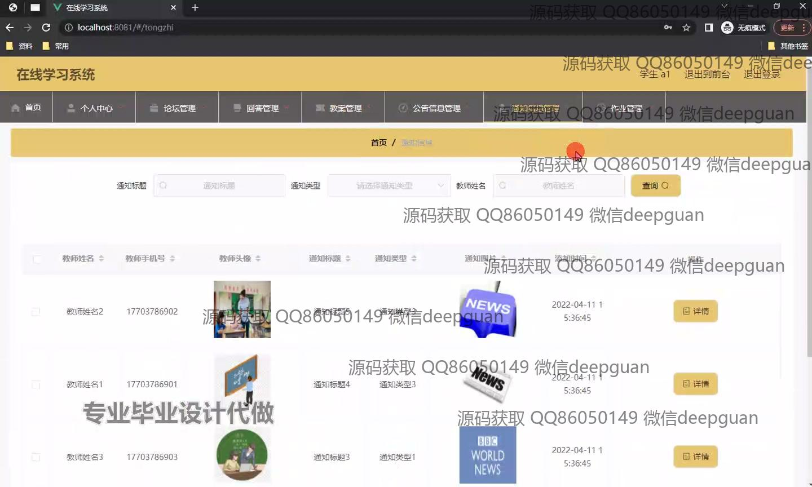

本代码来源于网络,仅供学习参考使用!

